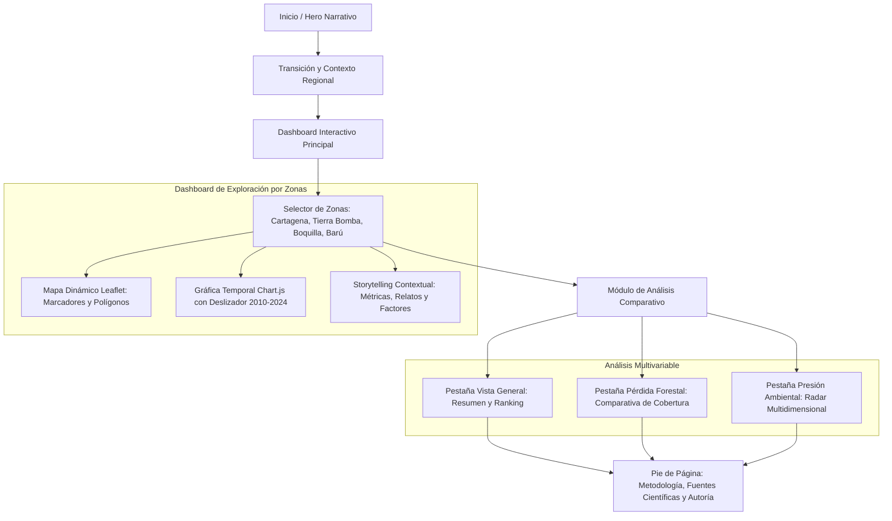

# El Paraíso que se Borra

> **Plataforma interactiva de narrativa de datos e investigación ambiental sobre la deforestación y la pérdida de ecosistemas costeros en Cartagena de Indias (2010–2024).**

[](https://proyecto-deforestacion.vercel.app/)
[](https://developer.mozilla.org/es/docs/Web/HTML)
[](https://developer.mozilla.org/es/docs/Web/CSS)
[](https://developer.mozilla.org/es/docs/Web/JavaScript)
[](https://leafletjs.com/)
[](https://www.chartjs.org/)

---

## Enlace de Despliegue en Vivo

El proyecto se encuentra publicado y disponible en producción en el siguiente enlace:

**URL Oficial:** [https://proyecto-deforestacion.vercel.app/](https://proyecto-deforestacion.vercel.app/)

---

## Autor

**Daniel Andres Jimenez Povea**  
*Investigación, visualización de datos y desarrollo web.*

---

## Descripción del Proyecto y Propuesta Narrativa

**El Paraíso que se Borra** es una experiencia de *data storytelling* (narrativa guiada por datos) diseñada para visibilizar una paradoja crítica en la región del Caribe colombiano: mientras la ciudad de Cartagena de Indias experimenta cifras históricas de afluencia turística e inversión inmobiliaria, sus cinturones de manglar y bosques costeros sufren una fragmentación y degradación aceleradas.

A través de una interfaz interactiva y dinámica, el usuario recorre cuatro nodos geográficos emblemáticos de la bahía y el litoral de Cartagena, contrastando la evolución temporal de la cobertura vegetal relativa frente a factores como el crecimiento de pasajeros aéreos, la proliferación hotelera, la ocupación no planificada del territorio y la erosión marina.

### Enfoque de Storytelling

La plataforma estructura la información en tres actos narrativos:

1. **El Escenario Global (Hero e Impacto Inicial):** Establece la magnitud regional del problema mediante indicadores macro (pérdida estimada en hectáreas, volumen de visitantes anuales y porcentaje residual de masa vegetal).
2. **La Inmersión Territorial (Dashboard Exploratorio):** Permite al usuario interactuar de manera simultánea con cartografía interactiva georreferenciada (Leaflet), series de tiempo interactivas (Chart.js) con deslizador temporal (2010–2024), tarjetas de métricas críticas y factores externos determinantes.
3. **La Síntesis Comparativa (Matriz de Presión Ambiental):** Ofrece vistas analíticas consolidadas: comparador de indicadores entre zonas, gráfico de barras de pérdida acumulada y un gráfico de radar multivariable que pondera la intensidad de factores antrópicos en una escala estandarizada de 1 a 10.

---

## Zonas de Estudio y Hallazgos Principales

El análisis abarca cuatro zonas representativas de la diversidad ecológica y las distintas modalidades de presión en la región de Cartagena:

| Zona | Tipología | Pérdida de Cobertura (2010-2024) | Hectáreas Estimadas | Nivel de Riesgo | Factores Determinantes |
| :--- | :--- | :---: | :---: | :---: | :--- |
| **Cartagena** | Área urbana periurbana | -20% | ~2.500 ha | Alto | Expansión urbana periférica, rellenos en Ciénaga de la Virgen y turismo masivo (~3.5M visitantes en 2024). |
| **Tierra Bomba** | Isla costera | -25% | ~400 ha | Crítico | Erosión marina severa (>5 m/año), destrucción de más de 250 viviendas y desarrollo hotelero de alto impacto. |
| **La Boquilla / Manzanillo** | Corredor costero norte | -15% | ~280 ha | Medio | Expansión inmobiliaria hacia el norte mitigada por iniciativas de compensación ambiental (40.000 plántulas sembradas por ANI). |
| **Barú / Playas Blancas** | Franja costera insular | -12% | ~200 ha | Alto | Sobreexplotación turística (+30% anual), invasión de 2.4 km de playa y vertimientos de aguas residuales en lagunas costeras. |

### Detalle por Nodo Geográfico

* **Cartagena (Área Urbana):**
  Evidencia una transformación radical de las riberas de manglar en sectores como El Pozón y los márgenes de la Ciénaga de la Virgen. La presión de la infraestructura receptora de turismo internacional (+22% en 2024 según Aerocivil) contrasta con la vulnerabilidad ante inundaciones pluviales y marinas.

* **Tierra Bomba (Isla Costera):**
  Representa el punto de mayor estrés ecológico y social. La tala de manglar protector ha dejado el borde costero expuesto al oleaje, ocasionando la pérdida de infraestructura comunitaria básica, puestos de salud y muelles de desembarco (documentado por AFP e Invemar).

* **La Boquilla / Manzanillo del Mar:**
  Territorio tradicional de comunidades afrodescendientes con prácticas históricas de pesca artesanal. El avance urbano de condominios de alta densidad desde la zona norte se contrapone a programas de restauración y reforestación de mangle rojo (*Rhizophora mangle*).

* **Barú / Playas Blancas:**
  Punto neurálgico del turismo de sol y playa. Enfrenta problemáticas asociadas a la saturación de visitantes, infraestructura turística informal sin plantas de tratamiento de aguas residuales y alertas ambientales sanitarias emitidas por la corporación ambiental CARDIQUE (Auto 0096 de 2025).

---

## Arquitectura de la Experiencia y Flujo de Usuario



---

## Características Técnicas e Interactivas

* **Visualización Cartográfica Georreferenciada:**
  Integración con Leaflet.js y capas cartográficas de OpenStreetMap / CartoDB Positron. Permite centrado fluido con transiciones animadas (`flyToBounds`), cálculo de perímetros geoespaciales y delimitación de corredores biológicos mediante polígonos geográficos específicos.

* **Gráficos Temporales Reactivos:**
  Implementación con Chart.js para visualizar el índice de cobertura vegetal, la pérdida porcentual acumulada y la recuperación relativa. Sincronización en tiempo real con un deslizador de años (`range input`) que recalcula dinámicamente las métricas visualizadas.

* **Gráfico de Radar Multivariable:**
  Representación radial del índice de presión ambiental para cada zona, evaluando cuatro vectores de impacto:
  1. Presión turística.
  2. Expansión hotelera e inmobiliaria.
  3. Grado de erosión costera y pérdida de línea de costa.
  4. Presión por urbanización e informalidad territorial.

* **Diseño Visual Basado en Glassmorphism y Microinteracciones:**
  Estilos CSS personalizados con soporte de paletas cromáticas contrastadas (tonos verdes bosque profundo `#2D5A3D`, carmesí de alerta ambiental `#E63946` y azul marino costero `#1D3557`), tarjetas con desenfoque de fondo (*backdrop-filter*), tipografía editorial (*Playfair Display* y *Montserrat*) y partículas sutiles animadas en el encabezado.

* **Diseño Responsivo:**
  Estructura flexible que adapta la barra de navegación lateral y los paneles de datos para dispositivos móviles, tabletas y pantallas de escritorio de alta resolución.

---

## Fuentes de Datos y Rigor Metodológico

Los datos exhibidos han sido consolidados a partir de reportes técnicos, estadísticas oficiales e investigaciones de acceso abierto:

1. **Global Forest Watch (GFW) / Hansen et al. (2024):** Series temporales de pérdida de cobertura arbórea y alertas satelitales basadas en sensores Landsat 7, 8 y 9.
2. **Instituto de Hidrología, Meteorología y Estudios Ambientales (IDEAM):** Sistema de Monitoreo de Bosques y Carbono (SMByC) de Colombia.
3. **Instituto de Investigaciones Marinas y Costeras (INVEMAR):** Informe sobre el estado de los manglares en Colombia y monitoreo de la dinámica de erosión litoral.
4. **Corporación Autónoma Regional del Canal del Dique (CARDIQUE):** Evaluaciones técnicas, inspecciones en campo y autos de seguimiento ambiental en Barú e islas adyacentes (Auto 0096 de febrero de 2025).
5. **Establecimiento Público Ambiental de Cartagena (EPA Cartagena):** Plan de gestión ambiental distrital y proyectos de restauración de manglares 2024–2027.
6. **Aeronáutica Civil de Colombia (Aerocivil):** Boletines mensuales y anuales de movilización de pasajeros nacionales e internacionales hacia el Aeropuerto Internacional Rafael Núñez (2024).
7. **Agencia Nacional de Infraestructura (ANI) / Ministerio de Transporte:** Registros de compensación forestal y siembra comunitaria en el corredor costero norte (2023).
8. **Agencia France-Presse (AFP):** Registro periodístico y testimonios comunitarios sobre pérdida de línea de costa e infraestructura en la Isla de Tierra Bomba (marzo de 2024).

> **Nota metodológica:** Los valores de cobertura vegetal se expresan mediante un índice relativo normalizado tomando como año base el 2010 (2010 = 100), facilitando el análisis visual de tendencias acumuladas frente a la variabilidad intrínseca de la resolución espacial satelital.

---

## Estructura del Repositorio

```text
Proyecto-Deforestacion/
|-- assets/
|   `-- images/
|       |-- favicon.png          # Icono de pestaña
|       `-- fondo.jpg            # Imagen de portada en alta resolución
|-- index.html                   # Marcado semántico estructurado
|-- style.css                    # Sistema de diseño, tokens, grillas y animaciones
|-- script.js                    # Modelos de datos, lógica de Chart.js y Leaflet
`-- README.md                    # Documentación técnica y narrativa del proyecto
```

---

## Instalación y Ejecución Local

Para visualizar y trabajar en el proyecto de forma local:

1. **Clonar el repositorio:**
   ```bash
   git clone https://github.com/Daniel-JP10/Proyecto-deforestacion.git
   ```

2. **Acceder al directorio:**
   ```bash
   cd Proyecto-deforestacion
   ```

3. **Abrir en el navegador:**
   - Puede abrir directamente el archivo `index.html` en cualquier navegador web moderno.
   - O bien, ejecutar un servidor web local estático (por ejemplo, con VS Code Live Server o mediante Python):
     ```bash
     python -m http.server 8000
     ```
   - Acceder en su navegador a `http://localhost:8000`.

---

## Despliegue en Producción

El proyecto se encuentra alojado y desplegado de forma continua en la plataforma **Vercel**:

* **Sitio Web Activo:** [https://proyecto-deforestacion.vercel.app/](https://proyecto-deforestacion.vercel.app/)

---

## Licencia y Consideraciones Éticas

Este proyecto ha sido desarrollado con propósitos académicos, de divulgación científica y de concienciación sobre el cuidado de los ecosistemas costeros del Caribe colombiano. La información proviene de fuentes públicas y registros institucionales citados con fines investigativos.
